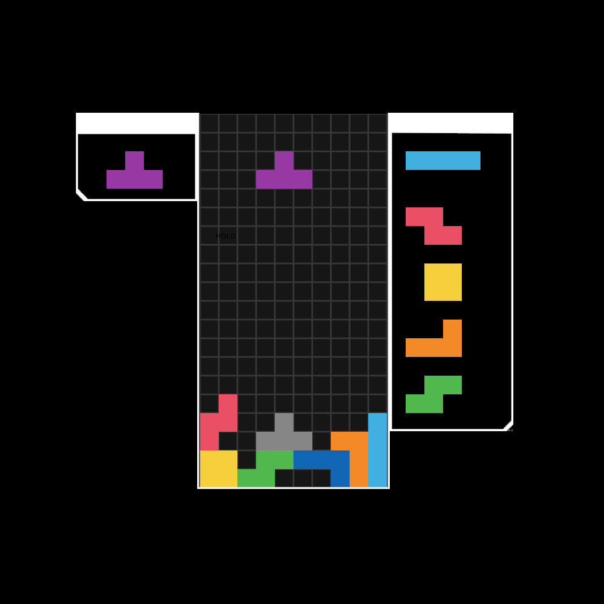

# Tetris-like game
*Inspired by tetr.io*

*Done in C# and Unity*

## To try the game out (WINDOWS ONLY)
1. Clone this repository
2. Unzip blockstacker-game.zip
3. Click on the blockstacker-game.exe file to run

## Gameplay

## Features
1. 7-Bag Randomizer system
2. Hold Piece

## Controls
1. Moving (Left and right arrow keys)
2. Soft Drop (Down arrow key)
3. Hard Drop (Spacebar)
4. Clockwise rotate (X)
5. Anti-clockwise rotate (Z)
6. Hold piece (Left shift)
7. Restart (R)
8. Quit application (Escape)

## Unresolved and known issues
1. Super Rotation System(SRS) does not work as intended 
2. User Inteface incomplete
3. Lack of customizability of controls (ARR, DAS, keybinds)
4. No sound effects, music etc.

## References
Assets from [here](https://you.have.fail/tetrioplus/)
Skin name: Light Four.lol by Sausage2580